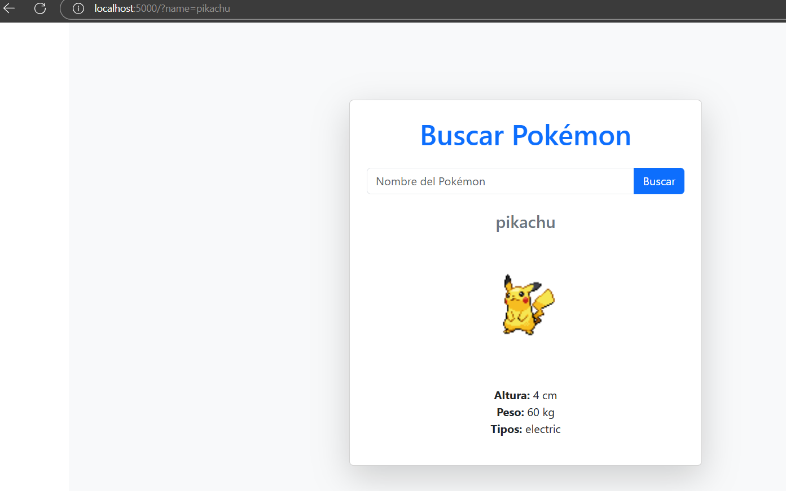

# PokeApiApp - Prueba Tecnica BACK-END

##  Descripcion
Aplicación .NET Core 9.0 que interactúa con la PokeAPI para obtener información de Pokémon, almacenándola localmente en SQL Server para consultas futuras.

##  Instrucciones de Despliegue

###  Requisitos Previos
- Docker y Docker Compose instalados
- Conexión a internet para descargar imágenes

### Configuracion
1. Clonar el repositorio:
   ```bash
   git clone https://github.com/osrol88/PokeApp.git
   cd PokeApiApp

2. Ejecutar el sistema:
   ```bash
   docker-compose up --build

  ### ConnectionStrings
- cadena
   ```bash
   "ConnectionStrings": {
   "pokeConn": "Data Source=localhost;Initial Catalog=PokemonDb;User Id=test;Password=StrongPass123;Persist Security Info=True; Connect Timeout=600;Max Pool Size=100;Encrypt=False;TrustServerCertificate=True;"
  }
 
### Servicios Desplegados
- Servicio	Puerto	Acceso
- SQL Server	1433	sa/StrongPass123
- Aplicación Web	5000	http://localhost:5000



  ### Estructura del Proyecto
   ```bash
  PokeApiApp/
  ├── PokeApiApp.API/           # Web API
  ├── PokeApiApp.Application/   # Lógica de negocio
  ├── PokeApiApp.Domain/        # Entidades
  ├── PokeApiApp.Infrastructure/# Acceso a datos
  ├── PokeApiApp.Tests/         # Pruebas unitarias
  └── PokeApiApp.Web/           # Frontend (Razor Pages)

 ### Estructura del Proyecto
- Base de datos: SQL Server 2022 Express
- ORM: Dapper y Entity Framework Core (para la creacion de las tablas)
- Arquitectura: Domain-Driven Design (DDD)
- Inyección de dependencias
- Pruebas Unitarias
